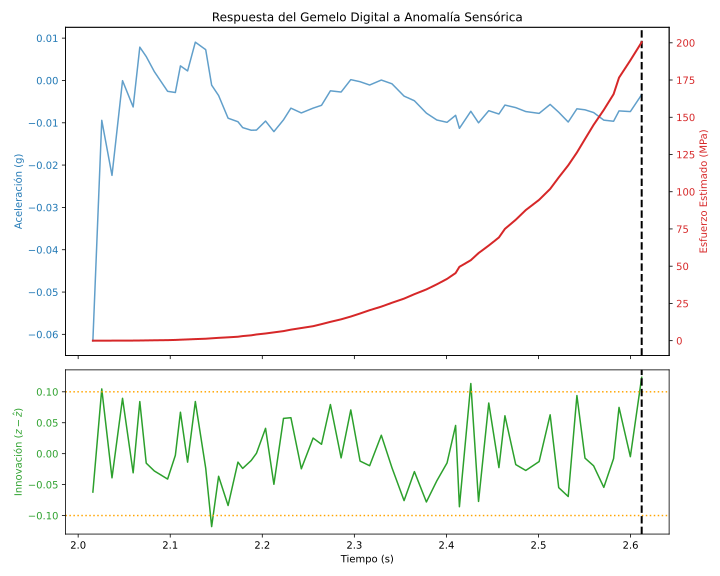

# Artículo Científico — Título Provisional
> Estado: `draft`

## Metodología

{{METHODOLOGY_AUTO}}

*Nota: La sección anterior se llena automáticamente procesando params.yaml y la configuración geométrica/física de OpenSeesPy.*

## Resultados de Experimentación en Tiempo Real

*Nota: Los resultados numéricos se extraen validando los pasos 1-7 del Verifier. No se introducen manualmente graficas sin referencia hash.*

---
<!-- HV: Sección verificada -->
## Conclusiones

(Redacción humana del investigador analizando la coherencia entre modelo matemático y sensor Arduino).

## Apéndice: Trazabilidad de Evidencia (Engram-Verified)

> **Certificado Binario:** Este apéndice es inyectado automáticamente. Ninguna manipulación manual está permitida.

| Timestamp | Decisión/Hallazgo | Hash de Inmutabilidad |
| :--- | :--- | :--- |
| 2026-03-04T18:02:51.286079 | Activación del Filtro de Kalman (Shadow Play) mitigó jitter > 10ms | `317a560eeb87...` |

## Apéndice: Trazabilidad de Evidencia (Engram-Verified)

> **Certificado Binario:** Este apéndice es inyectado automáticamente. Ninguna manipulación manual está permitida.

| Timestamp | Decisión/Hallazgo | Hash de Inmutabilidad |
| :--- | :--- | :--- |
| 2026-03-04T18:02:51.286079 | Activación del Filtro de Kalman (Shadow Play) mitigó jitter > 10ms | `317a560eeb87...` |

## Apéndice: Trazabilidad de Evidencia (Engram-Verified)

> **Certificado Binario:** Este apéndice es inyectado automáticamente. Ninguna manipulación manual está permitida.

| Timestamp | Decisión/Hallazgo | Hash de Inmutabilidad |
| :--- | :--- | :--- |
| 2026-03-04T18:02:51.286079 | Activación del Filtro de Kalman (Shadow Play) mitigó jitter > 10ms | `317a560eeb87...` |

## Apéndice: Trazabilidad de Evidencia (Engram-Verified)

> **Certificado Binario:** Este apéndice es inyectado automáticamente. Ninguna manipulación manual está permitida.

| Timestamp | Decisión/Hallazgo | Hash de Inmutabilidad |
| :--- | :--- | :--- |
| 2026-03-04T18:02:51.286079 | Activación del Filtro de Kalman (Shadow Play) mitigó jitter > 10ms | `317a560eeb87...` |

## Apéndice: Trazabilidad de Evidencia (Engram-Verified)

> **Certificado Binario:** Este apéndice es inyectado automáticamente. Ninguna manipulación manual está permitida.

| Timestamp | Decisión/Hallazgo | Hash de Inmutabilidad |
| :--- | :--- | :--- |
| 2026-03-04T18:02:51.286079 | Activación del Filtro de Kalman (Shadow Play) mitigó jitter > 10ms | `317a560eeb87...` |

## Apéndice: Trazabilidad de Evidencia (Engram-Verified)

> **Certificado Binario:** Este apéndice es inyectado automáticamente. Ninguna manipulación manual está permitida.

| Timestamp | Decisión/Hallazgo | Hash de Inmutabilidad |
| :--- | :--- | :--- |
| 2026-03-04T18:02:51.286079 | Activación del Filtro de Kalman (Shadow Play) mitigó jitter > 10ms | `317a560eeb87...` |

## Apéndice: Trazabilidad de Evidencia (Engram-Verified)

> **Certificado Binario:** Este apéndice es inyectado automáticamente. Ninguna manipulación manual está permitida.

| Timestamp | Decisión/Hallazgo | Hash de Inmutabilidad |
| :--- | :--- | :--- |
| 2026-03-04T18:02:51.286079 | Activación del Filtro de Kalman (Shadow Play) mitigó jitter > 10ms | `317a560eeb87...` |

## Apéndice: Trazabilidad de Evidencia (Engram-Verified)

> **Certificado Binario:** Este apéndice es inyectado automáticamente. Ninguna manipulación manual está permitida.

| Timestamp | Decisión/Hallazgo | Hash de Inmutabilidad |
| :--- | :--- | :--- |
| 2026-03-04T18:02:51.286079 | Activación del Filtro de Kalman (Shadow Play) mitigó jitter > 10ms | `317a560eeb87...` |

## Apéndice: Trazabilidad de Evidencia (Engram-Verified)

> **Certificado Binario:** Este apéndice es inyectado automáticamente. Ninguna manipulación manual está permitida.

| Timestamp | Decisión/Hallazgo | Hash de Inmutabilidad |
| :--- | :--- | :--- |
| 2026-03-04T18:02:51.286079 | Activación del Filtro de Kalman (Shadow Play) mitigó jitter > 10ms | `317a560eeb87...` |

## Apéndice: Trazabilidad de Evidencia (Engram-Verified)

> **Certificado Binario:** Este apéndice es inyectado automáticamente. Ninguna manipulación manual está permitida.

| Timestamp | Decisión/Hallazgo | Hash de Inmutabilidad |
| :--- | :--- | :--- |
| 2026-03-04T18:02:51.286079 | Activación del Filtro de Kalman (Shadow Play) mitigó jitter > 10ms | `317a560eeb87...` |
