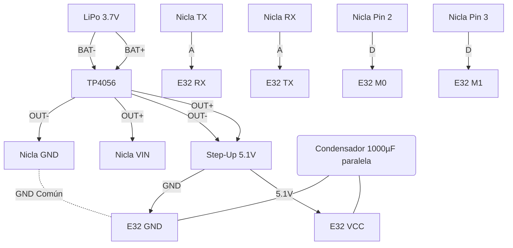

# Guía de Instalación Rápida en Campo: Nodo Edge (Nicla + LoRa)
**Ubicación:** Presa del Norte "La Esperanza" — Columna A-12
**Objetivo:** Ensamblado, despliegue y calibración del Búnker Inalámbrico

---

## 1. Materiales Mínimos 🧰
*   **1x** Arduino Nicla Sense ME (Cerebro + BHI260AP)
*   **1x** Módulo LoRa Ebyte E32-915T30D (1W, 915 MHz)
*   **1x** Antena LoRa 915MHz (Fibra de vidrio/Látigo, ganancia > 5 dBi)
*   **1x** Batería LiPo 3.7V (Min. 2000 mAh)
*   **1x** Módulo Cargador TP4056 (Protección Carga/Descarga)
*   **1x** Regulador Step-Up (Ajustado a 5.1V constante para el E32)
*   **1x** Condensador electrolítico (1000 µF / 10V)
*   Cables Dupont, cinta de montaje exterior (3M VHB), sellador de silicona/caja IP67.

---

## 2. Diagrama de Conexiones (Cableado Crítico) 🔌
El E32 requiere **hasta 600mA** al transmitir. El Nicla no puede alimentarlo. Tienen fuentes separadas pero unifican GND.


*(**A** = Lógica 3.3V UART directo, **D** = Lógica Digital)*

*Nota:* Asegúrate de tener la **Antena conectada** al E32 antes de encender. Transmitir sin antena destruye el módulo.

---

## 3. Protocolo de Despliegue en 4 Pasos 🚀

### Paso 1: Flasheo y Configuración en Laboratorio (El Cajón)
1. Conecta el USB al gateway (receptor). Ejecuta: `python tools/lora_at_config.py`
2. Conecta el Nicla por USB. Sube el firmware: `src/firmware/nicla_edge_field.ino`

### Paso 2: Instalación Física en la Presa (08:00 AM)
1. Fija la caja estanca a la columna A-12 usando cinta VHB limpiando antes el concreto.
2. Enciende el sistema completo.
3. El LED Verde del Nicla debería parpadear indicando inicialización de IMU BHI260AP.

### Paso 3: Calibración de Silencio (La Línea Base)
En el Gateway/Laptop a 8km de distancia (o al pie de represa):
```bash
# ¡Aléjate de la columna y no provoques vibraciones!
python tools/baseline_calibration.py --port /dev/ttyUSB0 --duration 1800
```
*Espera 30 minutos.* El script creará el archivo `config/field_baseline.yaml` con la $f_n$ y el ruido $\sigma$ base reales.

### Paso 4: Cierre del Búnker e Inicio de Auditoría
Ejecuta el Sincronizador Bélico desde el Gateway:
```bash
python src/physics/bridge.py /dev/ttyUSB0
```
Verifica que el Terminal consiga *Baseline* y el Engram empiece a registrar. Si no arroja alertas `EXTREME` en las primeras 2 horas, el sistema es soberano y puedes abandonar el lugar.

---
*Protocolo generado por el Búnker Digital — Abril 2026*
